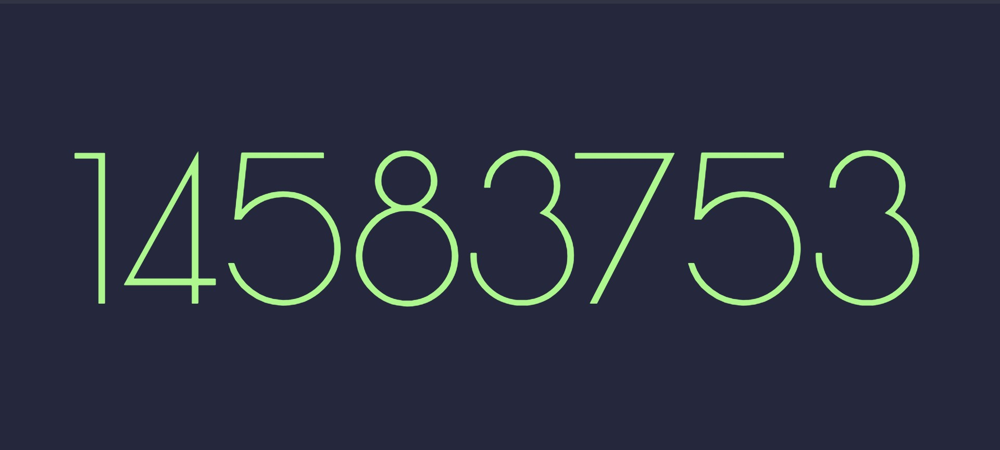

# Ethereum BlockNumberer

### A Basic Web App that displays current Ethereum Block Number

Made for Experimentation with Web3.py library

## Tech Stack
- Python
  - Flask
  - Web3
- HTML5
- CSS3
- Bootstrap 5
